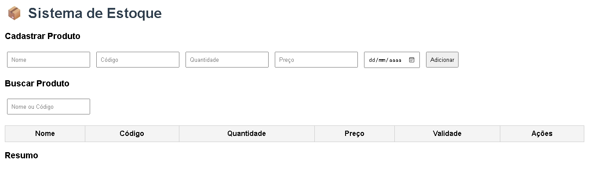

# Software-de-gerenciamento-de-estoque-

Este projeto é um software desenvolvido para auxiliar no controle de estoque, oferecendo funcionalidades de cadastro, movimentação e relatórios feito em Html, Python, C++.

## Ilustração

## Funcionalidades
- Cadastro de produtos e categorias
- Controle de entrada e saída de mercadorias
- Relatórios de movimentação e estoque atual
- Interface amigável desenvolvida em Unity/Framework escolhido

## Como usar
1. Clone este repositório
2. Crie a pasta qualquer coloque o arquivo dentro e execute-o no seu navegador padrão 
